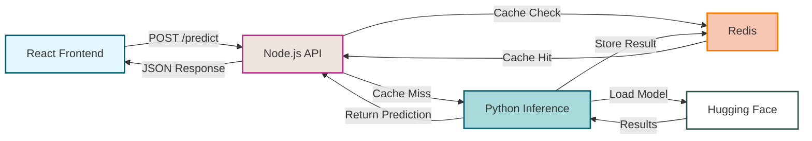

# 🚀 AI Inference Backend Boilerplate (For Efficient Backend Development for AI Inference and Solutions) 

> A powerful, faster, scalable full-stack boilerplace for AI inference using Node.js, Python, Redis, and Docker

### Wants to know the story of this boilerplace: [Read the blog post](https://itzmedhanu.medium.com/how-i-accidentally-built-a-rocket-ship-while-building-an-ai-backend-d61e9d00add4)


## ✨ Features

- **Fast & Scalable**: Combines the speed of Node.js with the ML capabilities of Python
- **Smart Caching**: Redis integration for lightning-fast repeated inferences
- **Modern Frontend**: Clean React UI for interacting with your AI models
- **Docker Ready**: One-command deployment with Docker Compose
- **Highly Customizable**: Easy to swap in different Hugging Face models

## 🏗️ Architecture



## 📂 Project Structure

```
ai-inference-backend/
│
├── node-api/                # Express REST API
│   ├── index.js             # API endpoints & caching logic
│   ├── runPython.js         # Python service communication
│   ├── redisClient.js       # Redis connection setup
│   └── Dockerfile           
│
├── python-inference/        # ML inference service
│   ├── app.py               # Flask API endpoints
│   ├── model.py             # Hugging Face model initialization
│   └── Dockerfile           
│
├── frontend/                # React UI
│   ├── src/
│   │   ├── App.jsx          # Main application component
│   │   └── main.jsx         # Entry point
│   ├── index.html           
│   ├── package.json         
│   └── Dockerfile           
│
├── docker-compose.yml       # Multi-container orchestration
└── README.md                # Project documentation
```

## 🚀 Quick Start

### Prerequisites

- Docker and Docker Compose installed
- Ports 5000 (API), 6000 (Python), and 6379 (Redis) available

### One-Command Deployment

```bash
# Clone the repository
git clone https://github.com/dhanushk-offl/ai-inference-backend-boilerplate.git
cd ai-inference-backend-boilerplate

# Build and start all services
docker-compose up --build
```

### Access Your Application

- 🖥️ **Frontend**: [http://localhost:5173](http://localhost:5173)
- 🔌 **API**: [http://localhost:5000](http://localhost:5000)

## 🔧 Customization Guide

### Swap in Your Own AI Model

Update `python-inference/model.py` to use any Hugging Face model:

```python
# Example: Switch to a text classification model
from transformers import pipeline

model = pipeline('text-classification', model="distilbert-base-uncased-finetuned-sst-2-english")
```

### Configure Caching Behavior

Adjust the Redis caching strategy in `node-api/index.js`:

```js
// Example: Set 24-hour cache for large text inputs
const cacheKey = `sentiment:${crypto.createHash('md5').update(text).digest('hex')}`;
await redis.set(cacheKey, JSON.stringify(result), 'EX', 86400); // 24 hours
```

### API Rate Limiting

Protect your service from overload by configuring the rate limiter:

```js
const limiter = rateLimit({
  windowMs: 15 * 60 * 1000,  // 15 minutes
  max: 100,                  // 100 requests per window
  standardHeaders: true,     // Return rate limit info in headers
  message: "Too many requests, please try again later"
});
```

## 🌐 Deployment Options

### Cloud Platforms (Free Tier)

| Platform | Best For | Free Tier |
|----------|----------|-----------|
| [Railway](https://railway.app/) | Full-stack deployment | 512MB RAM, $5 credit |
| [Render](https://render.com/) | Docker containers | 750 hours/month |
| [Fly.io](https://fly.io/) | Global distribution | 3 shared CPUs, 256MB RAM |
| [Heroku](https://www.heroku.com/) | Quick testing | 550 hours/month |

### Self-Hosting Ideas

- **Raspberry Pi**: Low-power, always-on solution
- **Old PC/Laptop**: Repurpose hardware you already have
- **VPS**: DigitalOcean Droplet ($5/month)
- **Home Lab**: Run on a NAS or dedicated server


## 🤔 Why This Architecture?

- **Node.js**: Handles HTTP requests efficiently, perfect for API servers
- **Python**: Deep learning ecosystem is Python-first (PyTorch, TensorFlow)
- **Redis**: In-memory caching drastically reduces repeated inference costs
- **Docker**: Ensures consistent environments across development and production


## 📄 License

This project is available under the MIT License.

---

Made with ❤️ by Dhanush Kandhan

⭐ Star this repo if you find it useful!